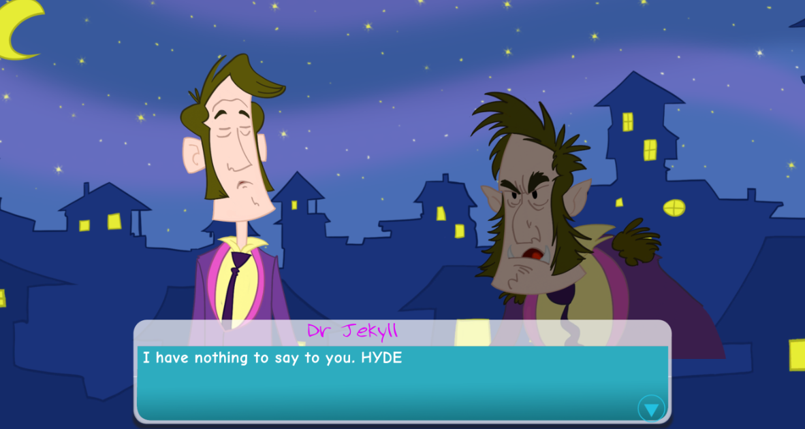

# Fungus_DrJ

Fungus_DrJ is the study Project. 

Studied with the Lecture on Udemy from Fungus Team. Created a 2D Game which can run on Android Platfom by using Unity with Fungus plugin.

Latest version
---
- Version 0.5  (10/15/2017)

License
---

https://www.udemy.com/make-interactive-games-with-fungus-unity3d-no-coding-required/learn/v4/overview

Please do not use it for any commercial purpose.

## Demos

